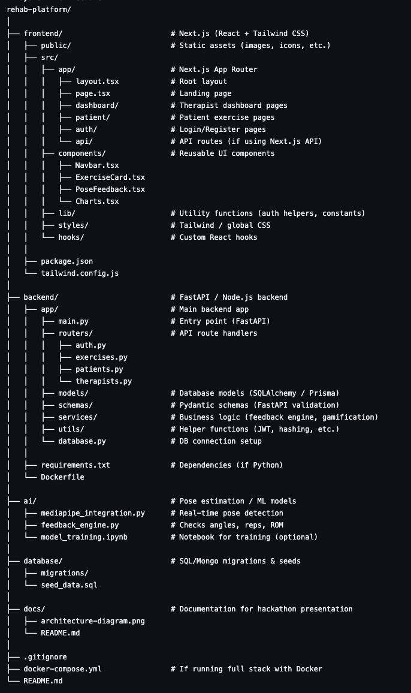

# 🏥 Gamified Digital Physiotherapy Platform  
**Hackathon: DataSprint 25 – Problem Statement (DSMN 1)**

---

## Problem Statement
Rehabilitation exercises for patients recovering from injuries or surgeries are:  
- Repetitive and monotonous → low motivation  
- Performed without feedback → poor accuracy & incomplete recovery  
- Inaccessible in rural/remote areas → health inequality  
- Hard to monitor at scale → therapist overload  

**Need:** An **interactive, accessible, and monitorable** rehabilitation solution that motivates patients and assists therapists.

---

## Solution Overview
We are building a **Gamified AI-Driven Digital Rehabilitation Platform** that:  
- Tracks **patient movements** via **computer vision / sensor fusion**  
- Provides **real-time corrective feedback**  
- Uses **gamification** to increase engagement  
- Stores **metrics & adherence logs** for therapists  
- Enables **remote monitoring & telemedicine integration**

---

## Tech Stack

### Backend
- **Python 3.x**
- **Flask / FastAPI** → API for patient & therapist modules  
- **SQLite / PostgreSQL** → patient logs, adherence data  
- **Computer Vision**:  
  - **MediaPipe / OpenPose** → pose estimation  
  - Optional: **IMU sensors** (accelerometer, gyroscope) for accuracy

To initialise
`pip install mediapipe opencv-python numpy` 

Run with `python physio_check.py`

### Frontend
- **TypeScript + React / Next.js**  
- **Charts.js / D3.js** → patient progress visualization  
- Responsive **patient + therapist dashboards**

### Other Tools
- **OpenCV** → video frame handling  
- **Telemedicine APIs** → remote therapist-patient interaction  
- **Docker (optional)** → deployment-ready packaging  

---

## Methodology

1. **Data Capture**
   - Input: Mobile camera feed (via IP Webcam / WebRTC) or wearable sensors  
   - Captured frames streamed into backend  

2. **Pose Estimation**
   - MediaPipe/OpenPose extracts joint coordinates  
   - Range of Motion (ROM) and posture accuracy calculated  

3. **Gamification & Feedback**
   - Scoring system for reps, time, and accuracy  
   - Audio/visual feedback for posture correction  

4. **Data Logging**
   - Exercise sessions stored in DB  
   - Metrics: reps completed, ROM %, adherence history  

5. **Remote Monitoring**
   - Therapist dashboard: view patient logs, download reports, track adherence  

---

## System Architecture

- Patient UI
- Therapist Dashboard 

## Goal
To build a **scalable, gamified, and AI-enabled digital physiotherapy assistant** that:  
- **Engages patients** → improves adherence  
- **Assists therapists** → saves monitoring time  
- **Bridges access gaps** → benefits rural/underserved populations

Presentation is available as a PDF in `misc\Presentation.pdf`.